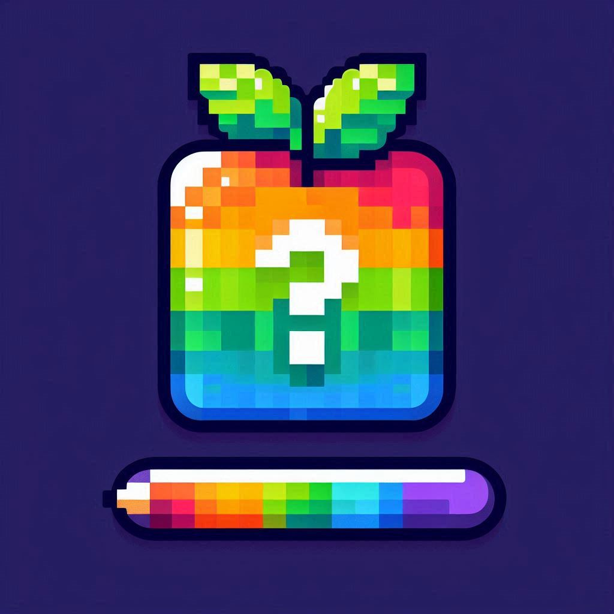

# Adivina Color Rgb



## Descarga:
[Descarga drive](https://drive.google.com/file/d/1s-wpo0m1yQT18gdxzD_kTtU1IA3_hryG/view?usp=sharing)

## Descripción

**Adivina Color Rgb** es un mini juego desarrollado con **Compose Multiplatform** que reta al usuario a
adivinar un color aleatorio mediante la modificación de sus valores RGB. La aplicación genera un
color objetivo aleatorio, el usuario intenta reproducirlo ajustando tres campos de entrada para cada
componente RGB, y luego se le indica qué tan cerca estuvo de acertar, mostrando un porcentaje de
coincidencia.

## Características

- **Generación de color aleatorio:** Al presionar el botón "Generar Color", se selecciona un color
  objetivo de forma aleatoria.
- **Adivinanza del color:** El usuario ajusta los valores de rojo, verde y azul mediante TextFields
  personalizados.
- **Retroalimentación:** Se calcula y muestra un porcentaje que indica qué tan cercano está el color
  armado por el usuario al color objetivo.
- **Interfaz adaptativa:** Los TextFields se adaptan visualmente (colores de borde, texto y
  placeholder) para mantener la legibilidad según el color de fondo.

## Captura de pantalla


## Tecnologías utilizadas

- **Kotlin**
- **Compose Multiplatform**
- **Desktop**

## Instalación y ejecución

### Requisitos

- [Android Studio](https://developer.android.com/studio)
  o [IntelliJ IDEA](https://www.jetbrains.com/idea/)
- JDK 11 o superior
- Gradle

### Pasos

1. **Clonar el repositorio:**

   ```bash
   gh repo clone christopher-two/AdivinaColorRgb
